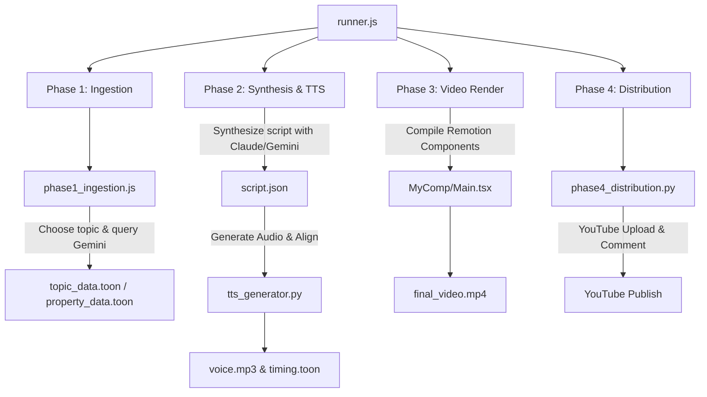

# Faceless Scheduled Explainer Video Pipeline

An autonomous, fully scheduled explainer video channel pipeline designed for widescreen (1920x1080) video formats. It dynamically rotates through educational, science, psychology, art, and niche topics, synthesizes highly engaging narrative scripts, generates realistic TTS voiceovers, compiles video frames with an animated whiteboard stickman, and publishes the final video to YouTube with interactive comments.

---

## 🚀 Key Features

* **Whiteboard Light Theme Aesthetic**: Clean white background (`#ffffff`) with a dotted grid paper pattern, slate/black text typography, and bright neon circles.
* **Animated Stickman Presenter**: A vector SVG presenter that breathes, bobs its head, and cycles through 4 poses:
  1. *Pointing/Presenting*: Points directly to the concept badge.
  2. *Celebrating*: Waves arms up in the air.
  3. *Thinking*: Hand on head with a floating question mark.
  4. *Eureka/Idea*: Points up with a glowing lightbulb.
* **Side-by-Side Detail Layout**: Widescreen-optimized transition where the active concept is highlighted on the left, and the animated stickman presents on the right.
* **Karaoke Subtitles**: Micro-animated, word-level highlighted subtitles on a light glassmorphic card.
* **Automated 60-Topic Rotation**: Rotates through educational topics across Science & Nature, Psychology, Art & Entertainment, Mythology, and Abstract categories.
* **Smart Dynamic Ingestion**: Connects to the Gemini API to dynamically generate 12 sub-concepts (with custom names, emojis, colors, and definitions) for the scheduled topic, with a local fallback generator in case of network or key failure.
* **Automatic Script Synthesis**: Generates conversational script narration conforming to high-retention audience algorithm strategies.
* **Headless Video Rendering**: Compiles audio tracks, transitions, background music, sound effects, and frames into high-quality MP4 using **Remotion**.
* **Scheduled Distribution**: Automatically uploads the finished video to YouTube using the Composio SDK and pinned interactive engagement comments.

---

## 🛠️ Architecture

The pipeline runs in 4 main phases managed by `runner.js`:



### Automation & Scheduling
A background cron job runs the runner script 3 times a day at high-traffic slots (**10:00 AM, 2:00 PM, and 6:00 PM**):
```bash
0 10,14,18 * * * node runner.js
```

---

## 📄 Documentation

Detailed checklists and implementation notes can be found in:
* **[walkthrough.md](./walkthrough.md)**: Pivot description, theme variables, animations, and deployment validations.
* **[task.md](./task.md)**: Implementation progress checklist.
* **[algorithm_strategy.md](./algorithm_strategy.md)**: SEO, click-through rate, and retention rules.

---

## ⚙️ Configuration & Environment Setup

1. Copy `.env.example` to `.env`.
2. Configure your API keys:
```env
GEMINI_API_KEY=your_gemini_api_key
ANTHROPIC_API_KEY=your_claude_api_key
YOUTUBE_API_KEY=your_youtube_api_key
```
3. Install dependencies:
```bash
npm install
cd video && npm install
```
4. Run manually:
```bash
node runner.js
```
