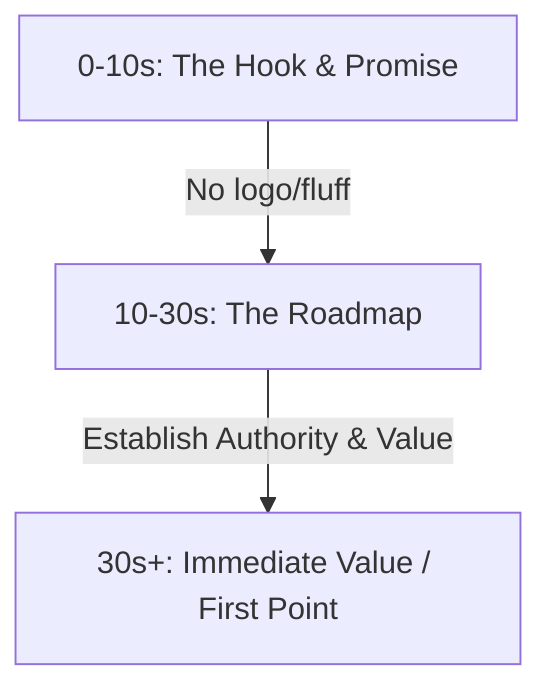

# YouTube Algorithm & Retention Strategy Guide (2026)
*Target Context for AI Scriptwriters & Content Creators*

This guide outlines actionable rules and frameworks optimized for the 2026 YouTube algorithm, focusing on widescreen educational/explainer videos. Use this as direct context when synthesizing scripts, title concepts, descriptions, and visual pacing directions.

---

## 1. The 2026 Algorithmic Framework: "Satisfaction-First"
YouTube’s recommendation algorithm functions as a **satisfaction prediction engine**. It no longer pushes videos based on raw views; it tests content with cohort audiences and scales distribution based on engagement and retention metrics.

### Key Metrics & Benchmarks
* **Average View Duration (AVD) / Retention:** The ultimate rank signal.
  * **Short Videos (<5 mins):** Target **65–75%** retention.
  * **Mid/Long Videos (5–10+ mins):** Target **50–60%** retention.
* **Click-Through Rate (CTR):** Target **4–8%+** depending on traffic source (Search vs. Browse/Home).
* **Satisfaction Index:** Driven by "Rate this Video" user surveys and high-value actions (shares, saves, deep-comment threads).

---

## 2. High-Retention Intro Structure (The First 30 Seconds)
The first **8–10 seconds** determine if a viewer stays. Shift from an "introductory" mindset to a **"promise and roadmap"** framework.

### The Hook (0–10 seconds)
* **Rule:** Never start with logo animation, brand intros, or name introductions (e.g., *"Welcome back to my channel..."*). Use a **1-second sonic tag** at most.
* **Frameworks:**
  * **Outcome Preview:** Display or state the payoff immediately: *"By the end of this video, you will know exactly how to..."*
  * **The Tension Premise:** Open with a startling statistic, a common costly mistake, or a controversial industry truth.
  * **The Real Question:** Ask the exact burning question the user searched for.

### The Roadmap (10–30 seconds)
* **Rule:** Detail *how* you will deliver the promise without giving away the final answers. 
* **Action:** Build authority and set expectations so the viewer knows their time is protected. Keep it under 20 seconds.

### The Curiosity Loop (Zeigarnik Effect)
To prevent mid-video drop-offs, use layered curiosity loops:
* **Macro Loop:** The overarching promise of the video (resolved only in the final 10% of the video).
* **Micro Loops:** A series of tension-release cycles. Before resolving one point, open a new question: *"This works 99% of the time, except in one specific scenario..."*
* **Pacing:** Keep the tension alive. Resolve the current point and immediately raise the next query to prevent exit clicks.

---

## 3. Title Click-Through Rate (CTR) Strategies
Titles must design for the viewer's immediate psychological trigger, while front-loading keywords for algorithmic categorization.

### Structural Rules
* **Character Limit:** **40–65 characters**. Characters beyond 60 are truncated on mobile screens.
* **Front-Loading:** Place your primary target keyword within the **first 4–5 words**.
* **Word Value:** Every word must serve to clarify the topic or trigger an emotional reaction. Avoid passive filler words.

### High-CTR Title Formulas
1. **The Compression Formula:** Contrast high value with minimal resource/time.
   * *Template:* `[High Value/Expertise] in [Short Time / Small Cost]`
   * *Example:* *30 Years of Real Estate Investing in 12 Minutes*
2. **Specificity & Numbers:** Precise numbers signal high authority and authenticity.
   * *Template:* `How to [Achieve Goal] using [Exact Number] [Method]`
   * *Example:* *How to Buy a Home with Only $4,850 in the Bank*
3. **The Blueprint / Transformation Frame:** Offer a clear roadmap to a desired state.
   * *Template:* `The [Topic] Blueprint for [Target Audience] in [Year]`
   * *Example:* *The 2026 Home Buying Blueprint (No Broker Needed)*
4. **The Safe Curiosity Gap:** Introduce a mystery that is highly relevant, avoiding empty clickbait.
   * *Template:* `Why [Action] is Actually [Opposite Outcome]`
   * *Example:* *Why a Low Interest Rate is Killing Your Equity*

---

## 4. Widescreen Pacing & Visual Guidelines
Landscape (16:9) explainer videos require visual momentum. Pacing should feel dynamic, preventing screen stagnation.

### The Momentum Principle: "Pacing over Perfection"
* **No Dead Air:** Aggressively trim gaps between words during voiceover recording. 
* **Pattern Interrupts:** Change the screen visual every **20–30 seconds**.
  * Use targeted zooms, B-roll, motion graphics, and typography overlays.
  * Switch camera angles or crop factor (e.g., wide to medium close-up) to reset viewer attention.
* **Kinetic Typography:** Animate key phrases word-by-word. This reinforces audio cues and assists muted or sound-off viewers.
* **Modular Segments:** Script the video in **3–5 chapters**. Each chapter should act as a mini-video with its own hook, escalation, and resolution.

---

## 5. Video Description SEO & Semantic Indexing
In 2026, description optimization targets both traditional search indices and LLM/AI search engine citation engines (e.g., Gemini, ChatGPT, Perplexity).

### Structural Blueprint

| Section | Target Content | Word Count / Specs |
| :--- | :--- | :--- |
| **1. The Hook Snippet** | Primary keywords + clear value proposition. Appears in search results page (SERP). | First 2 sentences (100–150 chars) |
| **2. Mini-Article** | Explains context, answering "How-To" and semantic variations. Optimized for AI crawlers. | 200–300 words |
| **3. Timestamps & Chapters** | `MM:SS - Chapter Title`. Integrates keywords and enables Google Search Key Moments. | 5–10 timestamps (for >5 min videos) |
| **4. Call to Action (CTA)** | Links to website, newsletter, or related videos. | 2–3 links max |

### Rules for SEO Writing
* **Semantic Diversity:** Do not repeat the same keyword. Use variations (e.g., if target is "real estate investing," use "buying rental property," "housing market strategies," and "property portfolio").
* **AI Search Citation Readiness:** Write descriptions that mirror natural voice questions: *"In this video, we answer: What is the best way to buy a house in 2026?"*
* **Accurate Transcripts:** Ensure captions are uploaded and edited. AI engines read transcripts to index video content for search queries.
